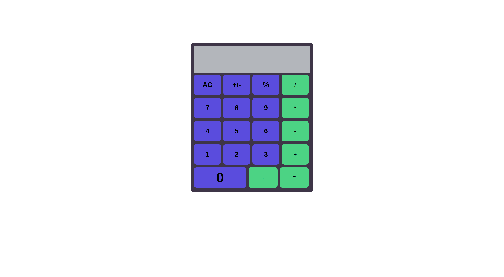

# Calculator

https://shemuel-bot.github.io/calculator/
## About

  

### description
A simple calculator app to perform mathematical functions.
I made this app to practice my html, css together with javascript skills up to that point.

### built with
These are tools that I used to build the site

<ul>
  <li>
    html
  </li>
  <li>
    css
  </li>
  <li>
    javascript
  </li>
</ul>

## Local setup

Open the index.html file on your web browser.
